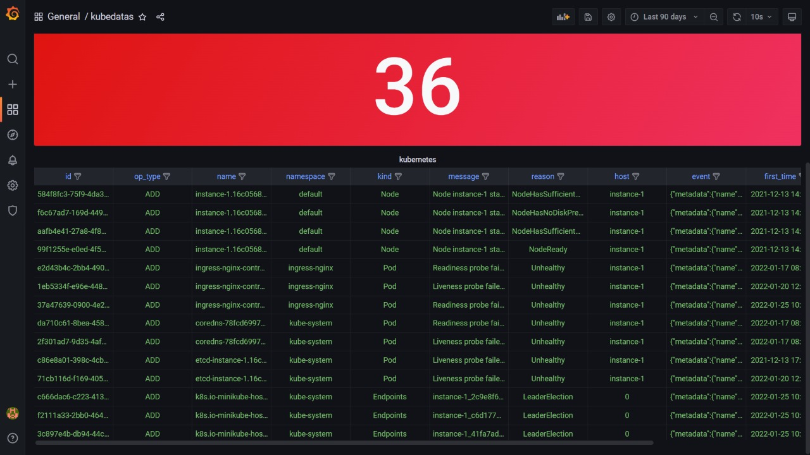

# kubviz
Visualize Kubernetes & DevSecOps Workflows. Tracks changes/events real-time across your entire K8s clusters, git repos, container registries, SBOM, Vulnerability foot print, etc. , analyzing their effects and providing you with the context you need to troubleshoot efficiently. Get the Observability you need, easily.

## How kubviz works
Kubviz client can be installed on any Kubernetes cluster. Kubviz agent runs in a kubernetes cluster where the changes/events need to be tracked. The agent detects the changes in real time and send those events via NATS JetStream and the same is received in the kubviz client. 

Kubviz client receives the events and passes it to Clickhouse database. The events present in the Clickhouse database can be visualized through Grafana.


###  How to install and run Kubviz:

#### Prerequisites
* A Kubernetes cluster 
* Helm binary

#### Prepare Namespace
```bash
kubectl create namespace kubviz
```

#### Client Installation
```bash
helm repo add kubviz https://kube-tarian.github.io/kubviz/
helm repo update

helm upgrade -i kubviz-client kubviz/client -n kubviz
```
NOTE: The kubviz client will also install NATS and Clickhouse. NATS service is exposed as Load balancer and the external IP of this service kubviz-client-nats-external has to be noted and passed during the kubviz agent installation.

```bash
kubectl get services kubviz-client-nats-external -n kubviz --output jsonpath='{.status.loadBalancer.ingress[0].ip}'
```

#### Grafana Installation
```bash
helm upgrade -i grafana-kubviz kubviz/grafana -n kubviz
```

#### Agent Installation
```bash
helm upgrade -i kubviz-agent kubviz/agent -n kubviz --set nats.host=<NATS IP Address>
```
## Use Cases

### Cluster Event Tracking



<br>

Use kubviz to monitor your cluster events, including:

- State changes 
- Errors
- Other messages that occur in the cluster

<br>

<br clear="all">
