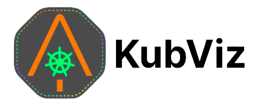
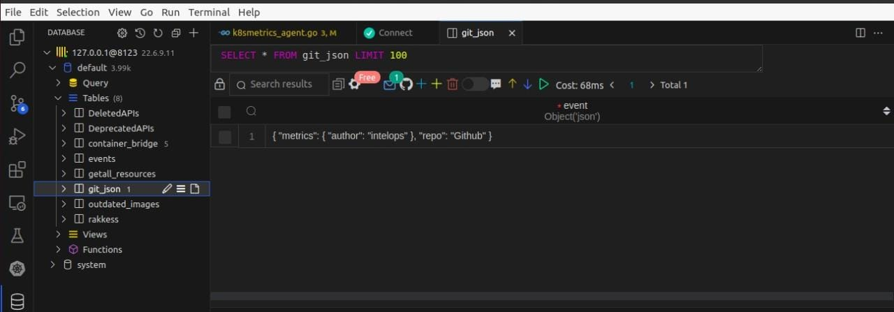
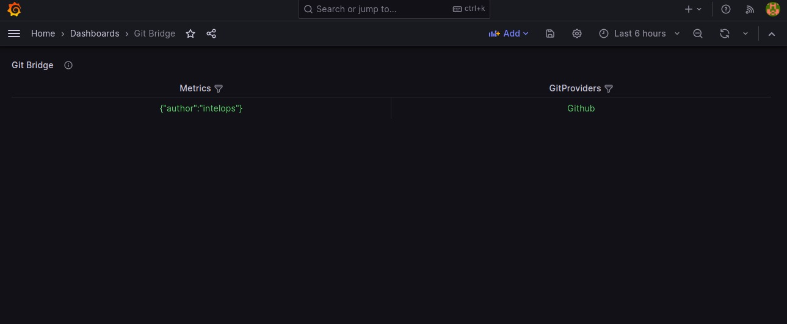
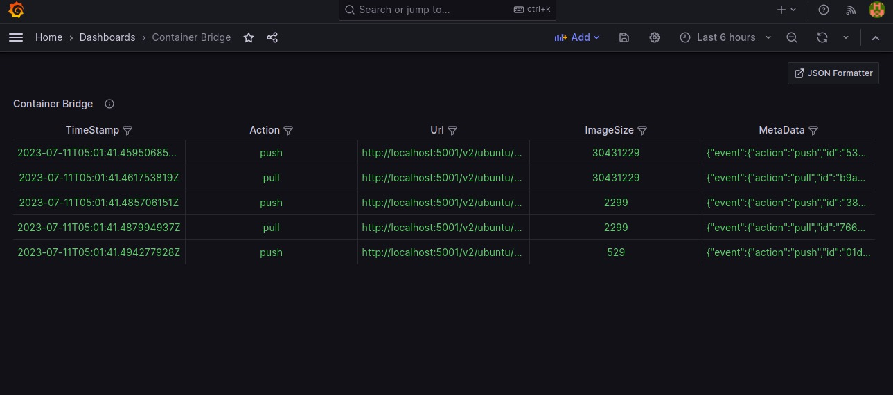

The open-source platform for Visualize Kubernetes & DevSecOps Workflows

[](https://github.com/kube-tarian/kubviz/actions/workflows/agent-docker-image.yml)
[](https://github.com/kube-tarian/kubviz/actions/workflows/client-image.yml)
[](https://github.com/kube-tarian/kubviz/actions/workflows/codeql.yml)
[](https://goreportcard.com/report/github.com/kube-tarian/kubviz)

[](https://github.com/kube-tarian/kubviz/blob/main/LICENSE)
[](https://github.com/kube-tarian/kubviz/discussions)
[](./code-of-conduct.md)
[](https://opensource.org/licenses/Apache-2.0)

<hr>

# KubViz

Visualize Kubernetes & DevSecOps Workflows. Tracks changes/events real-time across your entire K8s clusters, git repos, container registries, SBOM, Vulnerability foot print, etc. , analyzing their effects and providing you with the context you need to troubleshoot efficiently. Get the Observability you need, easily.

## Problem

Managing Kubernetes and DevSecOps workflows can be complex and challenging. Tracking changes, events, and their impacts across multiple clusters, Git repositories, and container registries can be time-consuming and error-prone. Without proper visibility and context, troubleshooting issues and ensuring system reliability and security becomes difficult.

## Solution: KubViz

KubViz addresses these challenges by providing a comprehensive solution for visualizing Kubernetes and DevSecOps workflows. It tracks changes/events in real-time, allowing you to easily analyze their effects and gain the necessary context for efficient troubleshooting. With KubViz, you can overcome the complexity and uncertainty associated with managing these workflows.

## How KubViz solves the problem:

### Event Tracking for Clusters

KubViz's event tracking component provides comprehensive visibility into the changes and events occurring within your Kubernetes clusters. By installing the KubViz client on any Kubernetes cluster, and deploying the KubViz agent within the cluster where event tracking is required, you can effectively monitor and capture real-time changes. The agent detects these changes in real time and seamlessly sends the events via NATS JetStream to the KubViz client. The KubViz client receives and processes the events, storing them in the ClickHouse database for further analysis and visualization. This robust event tracking mechanism allows you to gain insights into the dynamics of your clusters, understand the impact of changes, and proactively address any issues, ensuring the smooth functioning of your Kubernetes environment.

### Git Bridge for Change Tracking 

KubViz offers a seamless integration with Git repositories, empowering you to effortlessly track and monitor changes that occur within your codebase. By capturing events such as commits, merges, and other Git activities, KubViz provides valuable insights into the evolution of your code. This comprehensive change tracking capability allows you to analyze the effects of code modifications on your development and deployment workflows, facilitating efficient collaboration among teams. With KubViz's Git bridge, you can easily identify the root causes of issues, ensure code integrity, and maintain a clear understanding of the changes happening within your Git repositories

### Container Bridge for Registry Changes 

KubViz's container bridge monitors changes in your container registry, providing visibility into image updates, vulnerability footprints, and SBOM information. By tracking these changes, KubViz helps you proactively manage container security and compliance. With a clear understanding of the container landscape, you can mitigate risks, address vulnerabilities, and maintain a robust and secure infrastructure.

By combining event tracking, git bridge, and container bridge capabilities, KubViz offers the observability and context needed to streamline your Kubernetes and DevSecOps workflows. With visualizations provided by Grafana or the Vizual App, you can easily analyze and optimize your system, ensuring reliable deployments, efficient collaboration, and enhanced overall performance.

Take control of your Kubernetes and DevSecOps workflows with KubViz and experience the power of real-time tracking and visualization for improved system reliability and security.

## Quick Start

### Dependencies

You need <a href="https://go.dev/doc/install" target="_blank">`Go 1.16+`</a>, <a href="https://docs.docker.com/engine/install/" target="_blank">`Docker`</a> and <a href="https://docs.docker.com/compose/install/standalone/" target="_blank">`Docker Compose`</a>

It is possible to develop kubviz on Windows, but please be aware that all guides assume a Unix shell like bash or zsh.

Clone Kubviz and run it in Docker

```bash
git clone https://github.com/intelops/kubviz.git

cd kubviz
```

When we are running the kubviz outside of cluster(locally) we need to provide the cluster config to it.

To provide the cluster config:

Add your cluster config to quickstart/config file

```bash
docker-compose -f quickstart.yml up --build --force-recreate
```

This might take a minute or two. Once the output slows down and logs indicate a healthy system you're ready to roll!

A healthy system will show something along the lines of (the order of messages might be reversed):



**NOTE**

There are two important factors to get a fully functional system:

* You need to make sure that ports 8123, 5000, 5001, 9000, 8222, 4222, 3000, 8090, and 8091 are free

* Clickhouse Database is used in this example. Kubviz supports clickhouse as database backends. For the quickstart, we're mounting a persistent volume to store the clickhouse database in.

### Network architecture

**Git Bridge Agent:**

Api port : (port 8090) - This is the available port for us to send payload to git agent

**kubviz Agent:** This agent does not expose any port at the moment.

**Container Bridge Agent:**

Api port: (port 8091) - This is the available port for us and this port is already configured docker-registry which we are 

running locally for the testing

**Grafana:**
This service is available at the port 3000

Once all the services comes up:

open postman

send a sample json to localhost:8090/github

```bash
{
    "author":"intelops"
}
```


This will populate the git_json table



To populate the container_bridge table follow these steps

```bash
docker pull ubuntu:latest

docker tag ubuntu:latest localhost:5001/ubuntu:v1

docker push localhost:5001/ubuntu:v1
```



## Table of Contents
- [How KubViz works](#how-kubviz-works)
- [Architecture diagram](#architecture-diagram)
- [How to install and run Kubviz](#how-to-install-and-run-kubviz)
- [Use Cases](#use-cases)
- [Contributing](#contributing)
- [Code of Conduct](#code-of-conduct)
- [Support](#support)
- [License](#license)
- [Join our Slack channel](#join-our-slack-channel)

## How KubViz works

Kubviz client can be installed on any Kubernetes cluster. Kubviz agent runs in a kubernetes cluster where the changes/events need to be tracked. The agent detects the changes in real time and send those events via NATS JetStream and the same is received in the kubviz client. 

Kubviz client receives the events and passes it to Clickhouse database. The events present in the Clickhouse database can be visualized through Grafana or Vizual App.

## Architecture diagram


## How to install and run Kubviz

#### Prerequisites
* A Kubernetes cluster 
* Helm binary

#### Prepare Namespace
```bash
kubectl create namespace kubviz
```

#### Client Installation
```bash
helm repo add kubviz https://intelops.github.io/kubviz/
helm repo update

token=$(cat /dev/urandom | tr -dc 'a-zA-Z0-9' | fold -w 32 | head -n 1)
helm upgrade -i kubviz-client kubviz/client -n kubviz --set "nats.auth.token=$token"
```
**NOTE:** 
- If you want to enable Grafana with the agent deployment, add --set grafana.enabled=true to the helm upgrade command.
- The kubviz client will also install NATS and Clickhouse. The NATS service is exposed as a LoadBalancer, and you need to note the external IP of the service kubviz-client-nats-external and pass it during the kubviz agent installation.

    ```bash
    kubectl get services kubviz-client-nats-external -n kubviz --output jsonpath='{.status.loadBalancer.ingress[0].ip}'
    ```

#### Agent Installation

##### Deploying Agent on the Same Kubernetes Cluster as kubeviz Client:
1. Make sure you have the kubeviz client running on your Kubernetes cluster.
2. Run the following command to deploy the kubeviz agent:

```bash
helm upgrade -i kubviz-agent kubviz/agent -n kubviz \
  --set nats.host=<NATS IP ADDRESS> \
  --set "nats.auth.token=$token" \
  --set git_bridge.enabled=true \
  --set "git_bridge.ingress.hosts[0].host=<INGRESS HOSTNAME>",git_bridge.ingress.hosts[0].paths[0].path=/,git_bridge.ingress.hosts[0].paths[0].pathType=Prefix \
  --set container_bridge.enabled=true \
  --set "container_bridge.ingress.hosts[0].host=<INGRESS HOSTNAME>",container_bridge.ingress.hosts[0].paths[0].path=/,container_bridge.ingress.hosts[0].paths[0].pathType=Prefix
```
3. Replace "NATS IP ADDRESS" with the IP address of your NATS server.
4. Replace "INGRESS HOSTNAME" with the desired hostname for the Git Bridge and Container Bridge Ingress configurations.

##### Deploying Agent on a Different Kubernetes Cluster:
1. Run the following command to deploy the kubeviz agent:
```bash
helm upgrade -i kubviz-agent kubviz/agent -n kubviz --set nats.host=<NATS IP Address> --set "nats.auth.token=$token"  
```
2. Replace "NATS IP Address" with the IP address of your NATS server.

## Use Cases

### Cluster Event Tracking


<br>

Use kubviz to monitor your cluster events, including:

- State changes 
- Errors
- Other messages that occur in the cluster

<br>

<br clear="all">

### Deprecated Kubernetes APIs


<br>

- Visualize Deprecated Kubernetes APIs: KubeViz provides a clear visualization of deprecated Kubernetes APIs, allowing users to easily identify and update their usage to comply with the latest Kubernetes versions
- Track Outdated Images: With KubeViz, you can track and monitor outdated images within your clusters, ensuring that you are using the most up-to-date and secure versions.
- Identify Deleted APIs: KubeViz helps you identify any deleted APIs in your clusters, guiding you to find alternative approaches or replacements to adapt to changes in Kubernetes APIs.

<br>

<br clear="all">

## Contributing

You are warmly welcome to contribute to Compage.
Please refer the detailed guide [CONTRIBUTING.md](./CONTRIBUTING.md).

## Code of Conduct

See [CODE_OF_CONDUCT.md](CODE_OF_CONDUCT.md)

## Support

Reach out to me at one of the following places!

- Website at <a href="https://intelops.ai/" target="_blank">`Intelops`</a>
- Linkedin at <a href="https://www.linkedin.com/company/intelopsai/?originalSubdomain=in" target="_blank">`@Intelops`</a>
- Insert more social links here.

## License

[](https://opensource.org/licenses/Apache-2.0)

- **[Apache-2.0 license](https://opensource.org/licenses/Apache-2.0)**
- Copyright 2023 © <a href="https://intelops.ai/" target="_blank">Intelops</a>.

## Join our Slack channel