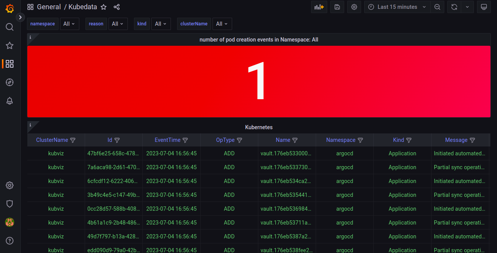

<p align="center"><b>KubViz: Visualize Kubernetes & DevSecOps Workflows.</b></p>

<h4 align="center">
    <a href="https://github.com/kube-tarian/kubviz/discussions">Discussions</a> 
</h4>

<h4 align="center">

[](https://github.com/kube-tarian/kubviz/actions/workflows/agent-docker-image.yml)
[](https://github.com/kube-tarian/kubviz/actions/workflows/client-image.yml)
[](https://github.com/kube-tarian/kubviz/actions/workflows/codeql.yml)
[](https://goreportcard.com/report/github.com/kube-tarian/kubviz)

[](https://github.com/kube-tarian/kubviz/blob/main/LICENSE)
[](https://github.com/kube-tarian/kubviz/discussions)
[](./code-of-conduct.md)
[](https://opensource.org/licenses/Apache-2.0)

</h4>

<hr>


# KubViz
Visualize Kubernetes & DevSecOps Workflows. Tracks changes/events real-time across your entire K8s clusters, git repos, container registries, SBOM, Vulnerability foot print, etc. , analyzing their effects and providing you with the context you need to troubleshoot efficiently. Get the Observability you need, easily.

## How KubViz works
Kubviz client can be installed on any Kubernetes cluster. Kubviz agent runs in a kubernetes cluster where the changes/events need to be tracked. The agent detects the changes in real time and send those events via NATS JetStream and the same is received in the kubviz client. 

Kubviz client receives the events and passes it to Clickhouse database. The events present in the Clickhouse database can be visualized through Grafana or Vizual App.

## Architecture diagram

 

###  How to install and run Kubviz:

#### Prerequisites
* A Kubernetes cluster 
* Helm binary

#### Prepare Namespace
```bash
kubectl create namespace kubviz
```

#### Client Installation
```bash
helm repo add kubviz https://kube-tarian.github.io/kubviz/
helm repo update

token=$(cat /dev/urandom | tr -dc 'a-zA-Z0-9' | fold -w 32 | head -n 1)
helm upgrade -i kubviz-client kubviz/client -n kubviz --set "nats.auth.token=$token"
```
NOTE: The kubviz client will also install NATS and Clickhouse. NATS service is exposed as Load balancer and the external IP of this service kubviz-client-nats-external has to be noted and passed during the kubviz agent installation.

```bash
kubectl get services kubviz-client-nats-external -n kubviz --output jsonpath='{.status.loadBalancer.ingress[0].ip}'
```

#### Agent Installation

##### Deploying Agent on the Same Kubernetes Cluster as kubeviz Client:
1. Make sure you have the kubeviz client running on your Kubernetes cluster.
2. Run the following command to deploy the kubeviz agent:

```bash
helm upgrade -i kubviz-agent kubviz/agent -n kubviz --set nats.host=<NATS IP Address> --set "nats.auth.token=$token" --set git_bridge.enabled=true --set git_bridge.ingress.hosts[0].host="<HOST NAME>",git_bridge.ingress.hosts[0].paths[0].path=/ --set container_bridge.enabled=true --set container_bridge.ingress.hosts[0].host="<HOST NAME>",container_bridge.ingress.hosts[0].paths[0].path=/ 
```
3. Replace "NATS IP Address" with the IP address of your NATS server.
4. Replace "INGRESS HOSTNAME" with the desired hostname for the Git Bridge and Container Bridge Ingress configurations.

##### Deploying Agent on a Different Kubernetes Cluster:
1. Run the following command to deploy the kubeviz agent:
```bash
helm upgrade -i kubviz-agent kubviz/agent -n kubviz --set nats.host=<NATS IP Address> --set "nats.auth.token=$token"  
```
2. Replace "NATS IP Address" with the IP address of your NATS server.

## Use Cases

### Cluster Event Tracking



<br>

Use kubviz to monitor your cluster events, including:

- State changes 
- Errors
- Other messages that occur in the cluster

<br>

<br clear="all">

### Deprecated Kubernetes APIs


<br>

- Visualize Deprecated Kubernetes APIs: KubeViz provides a clear visualization of deprecated Kubernetes APIs, allowing users to easily identify and update their usage to comply with the latest Kubernetes versions
- Track Outdated Images: With KubeViz, you can track and monitor outdated images within your clusters, ensuring that you are using the most up-to-date and secure versions.
- Identify Deleted APIs: KubeViz helps you identify any deleted APIs in your clusters, guiding you to find alternative approaches or replacements to adapt to changes in Kubernetes APIs.

<br>

<br clear="all">

## Contributing

You are warmly welcome to contribute to Compage.
Please refer the detailed guide [CONTRIBUTING.md](./CONTRIBUTING.md).

## Code of Conduct

See [CODE_OF_CONDUCT.md](CODE_OF_CONDUCT.md)

## License

Refer the licence - [LICENCE](./LICENSE.md).

## Join our Slack channel
