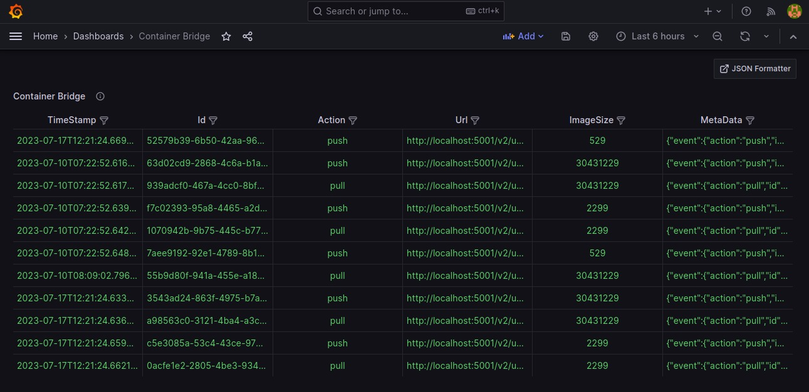

The open-source platform for Visualize Kubernetes & DevSecOps Workflows

[](https://github.com/kube-tarian/kubviz/actions/workflows/agent-docker-image.yml)
[](https://github.com/kube-tarian/kubviz/actions/workflows/client-image.yml)
[](https://github.com/kube-tarian/kubviz/actions/workflows/codeql.yml)
[](https://goreportcard.com/report/github.com/kube-tarian/kubviz)

[](https://github.com/kube-tarian/kubviz/blob/main/LICENSE)
[](https://github.com/kube-tarian/kubviz/discussions)
[](./code-of-conduct.md)
[](https://opensource.org/licenses/Apache-2.0)

<hr>

# KubViz

Visualize Kubernetes & DevSecOps Workflows. Tracks changes/events real-time across your entire K8s clusters, git repos, container registries, SBOM, Vulnerability foot print, etc. , analyzing their effects and providing you with the context you need to troubleshoot efficiently. Get the Observability you need, easily.

## Table of Contents
- [How KubViz works](#how-kubviz-works)
- [Architecture diagram](#architecture-diagram)
- [How to install and run Kubviz](#how-to-install-and-run-kubviz)
- [Use Cases](#use-cases)
- [Contributing](#contributing)
- [Code of Conduct](#code-of-conduct)
- [Support](#support)
- [License](#license)
- [Join our Slack channel](#join-our-slack-channel)

## How KubViz works

Kubviz client can be installed on any Kubernetes cluster. Kubviz agent runs in a kubernetes cluster where the changes/events need to be tracked. The agent detects the changes in real time and send those events via NATS JetStream and the same is received in the kubviz client. 

Kubviz client receives the events and passes it to Clickhouse database. The events present in the Clickhouse database can be visualized through Grafana or Vizual App.

KubViz's event tracking component provides comprehensive visibility into the changes and events occurring within your Kubernetes clusters.

KubViz offers a seamless integration with Git repositories, empowering you to effortlessly track and monitor changes that occur within your codebase. By capturing events such as commits, merges, and other Git activities.

KubViz also monitors changes in your container registry, providing visibility into image updates, vulnerability footprints, and SBOM information. By tracking these changes, KubViz helps you proactively manage container security and compliance.

## Architecture diagram


## How to install and run Kubviz

#### Prerequisites
* A Kubernetes cluster 
* Helm binary

#### Prepare Namespace

This command will creates a new **name-space** for your cluster.

```bash
kubectl create namespace kubviz
```

#### Client Installation

```bash
helm repo add kubviz https://intelops.github.io/kubviz/
helm repo update
```

The following command will generate a token. Please make sure to take note of this token as it will be used for both client and agent installation purposes.

```bash
token=$(cat /dev/urandom | tr -dc 'a-zA-Z0-9' | fold -w 32 | head -n 1)
```

```bash
helm upgrade -i kubviz-client kubviz/client -n kubviz --set "nats.auth.token=$token"
```
**NOTE:** 
- If you want to enable Grafana with the client deployment, add --set grafana.enabled=true to the helm upgrade command.

```bash
helm upgrade -i kubviz-client kubviz/client -n kubviz --set "nats.auth.token=$token" --set grafana.enabled=true
```

- The kubviz client will also install NATS and Clickhouse. The NATS service is exposed as a LoadBalancer, and you need to note the external IP of the service **kubviz-client-nats-external** and pass it during the kubviz agent installation.

The following command will retrieve the IP address. Please make sure to take note of this IP address as it will be used for agent installation if your agent is located in a different cluster.

```bash
kubectl get services kubviz-client-nats-external -n kubviz --output jsonpath='{.status.loadBalancer.ingress[0].ip}'
```

#### Agent Installation

There are two approaches that can be used:

1. Deploying the agent in one cluster and forwarding the data to another cluster where the client is located.
2. Deploying the agent in the same cluster where the client is present.

##### Deploying Agent on the Same Kubernetes Cluster as kubeviz Client:
1. Make sure you have the kubeviz client running on your Kubernetes cluster.
2. Run the following command to deploy the kubeviz agent:

```bash
helm upgrade -i kubviz-agent kubviz/agent -n kubviz \
  --set nats.host=<NATS SERVICE NAME> \
  --set "nats.auth.token=$token" \
  --set git_bridge.enabled=true \
  --set "git_bridge.ingress.hosts[0].host=<INGRESS HOSTNAME>",git_bridge.ingress.hosts[0].paths[0].path=/,git_bridge.ingress.hosts[0].paths[0].pathType=Prefix \
  --set container_bridge.enabled=true \
  --set "container_bridge.ingress.hosts[0].host=<INGRESS HOSTNAME>",container_bridge.ingress.hosts[0].paths[0].path=/,container_bridge.ingress.hosts[0].paths[0].pathType=Prefix
```
3. Replace "NATS SERVICE NAME" with the Nats Service Name of your NATS server.
4. Replace "INGRESS HOSTNAME" with the desired hostname for the Git Bridge and Container Bridge Ingress configurations.

##### Deploying Agent on a Different Kubernetes Cluster:
1. Run the following command to deploy the kubeviz agent:

```bash
helm upgrade -i kubviz-agent kubviz/agent -n kubviz \
  --set nats.host=<NATS IP ADDRESS> \
  --set "nats.auth.token=$token" \
  --set git_bridge.enabled=true \
  --set "git_bridge.ingress.hosts[0].host=<INGRESS HOSTNAME>",git_bridge.ingress.hosts[0].paths[0].path=/,git_bridge.ingress.hosts[0].paths[0].pathType=Prefix \
  --set container_bridge.enabled=true \
  --set "container_bridge.ingress.hosts[0].host=<INGRESS HOSTNAME>",container_bridge.ingress.hosts[0].paths[0].path=/,container_bridge.ingress.hosts[0].paths[0].pathType=Prefix 
```
2. Replace "NATS IP Address" with the IP address of your NATS server.
3. Replace "INGRESS HOSTNAME" with the desired hostname for the Git Bridge and Container Bridge Ingress configurations.

#### Creating Webhook in GitHub

Follow these steps to [create a webhook in your GitHub repository](https://github.com/intelops/kubviz/blob/main/githubWebhook.md)

#### Creating Webhook in GitLab

Follow these steps to [create a webhook in your GitLab repository](https://github.com/intelops/kubviz/blob/main/gitlabWebhook.md)

#### Creating Webhook in DockerHub

Follow these steps to [create a webhook in your DockerHub repository](https://github.com/intelops/kubviz/blob/main/dockerhubWebhook.md)

## Use Cases

### Cluster Event Tracking


<br>

Use kubviz to monitor your cluster events, including:

- State changes 
- Errors
- Other messages that occur in the cluster

<br>

<br clear="all">

### Deprecated Kubernetes APIs


<br>

- Visualize Deprecated Kubernetes APIs: KubeViz provides a clear visualization of deprecated Kubernetes APIs, allowing users to easily identify and update their usage to comply with the latest Kubernetes versions
- Track Outdated Images: With KubeViz, you can track and monitor outdated images within your clusters, ensuring that you are using the most up-to-date and secure versions.
- Identify Deleted APIs: KubeViz helps you identify any deleted APIs in your clusters, guiding you to find alternative approaches or replacements to adapt to changes in Kubernetes APIs.

<br>

<br clear="all">

### Git Repository Events Tracking


<br>

- Using Kubviz you can monitor your repository events which all the events you selected while creating the webhook for your repository.

- By capturing events such as commits, merges, and other Git activities, KubViz provides valuable insights into the evolution of your code. This comprehensive change tracking capability allows you to analyze the effects of code modifications on your development and deployment workflows, facilitating efficient collaboration among teams.With this feature, you can easily identify the root causes of issues, ensure code integrity, and maintain a clear understanding of the changes happening within your Git repositories

<br>

<br clear="all">

### Container Registry Events Tracking



<br>

There is an interesting feature of Kubviz is you can also monitors changes in your container registry, providing visibility into image updates, vulnerability footprints, and SBOM information. By tracking these changes, KubViz helps you proactively manage container security and compliance. With a clear understanding of the container landscape, you can mitigate risks, address vulnerabilities, and maintain a robust and secure infrastructure.


<br>

<br clear="all">

## Contributing

You are warmly welcome to contribute to Compage.
Please refer the detailed guide [CONTRIBUTING.md](./CONTRIBUTING.md).

## Code of Conduct

See [CODE_OF_CONDUCT.md](CODE_OF_CONDUCT.md)

## Support

Reach out to me at one of the following places!

- Website at <a href="https://intelops.ai/" target="_blank">`Intelops`</a>
- Linkedin at <a href="https://www.linkedin.com/company/intelopsai/?originalSubdomain=in" target="_blank">`@Intelops`</a>
- Insert more social links here.

## License

[](https://opensource.org/licenses/Apache-2.0)

- **[Apache-2.0 license](https://opensource.org/licenses/Apache-2.0)**
- Copyright 2023 © <a href="https://intelops.ai/" target="_blank">Intelops</a>.

## Join our Slack channel