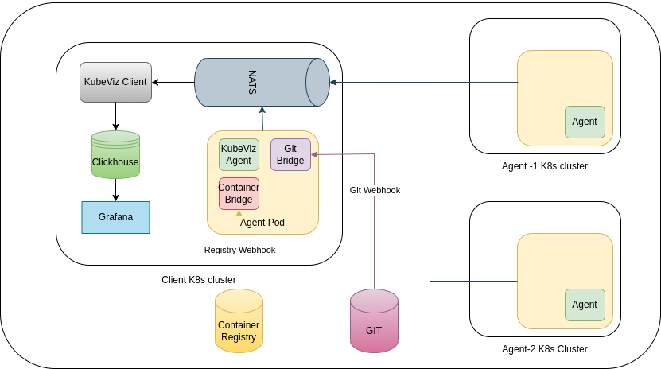
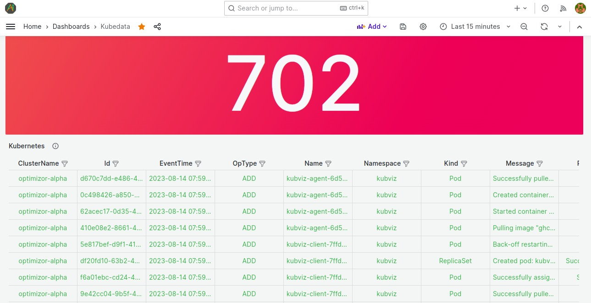
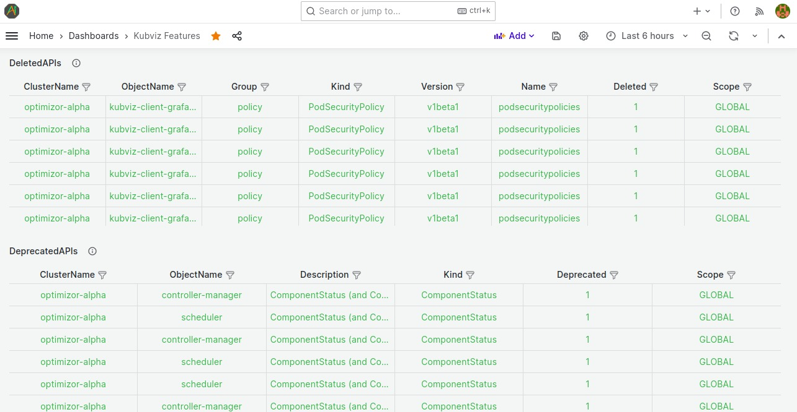
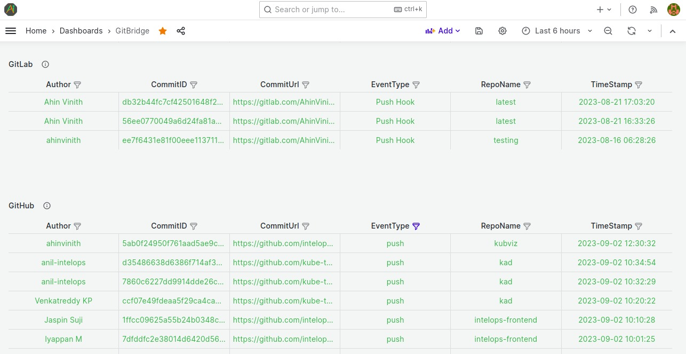
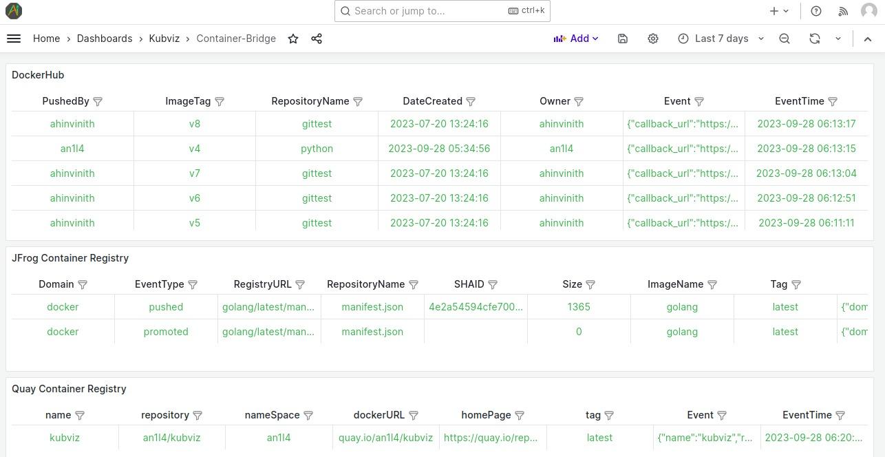
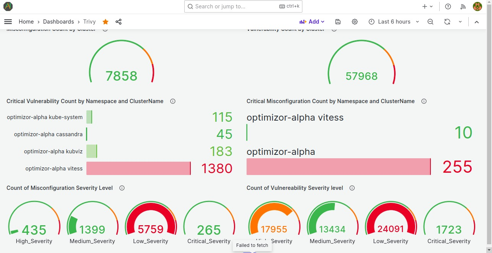
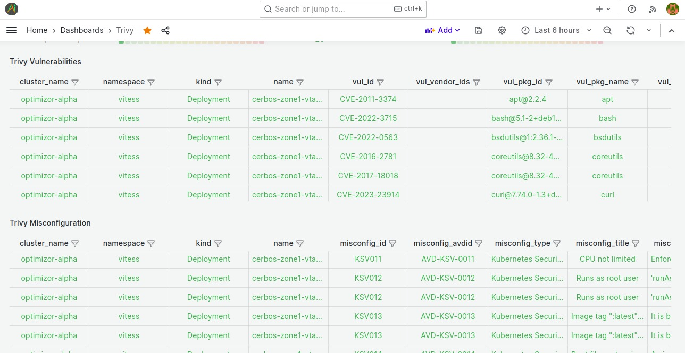
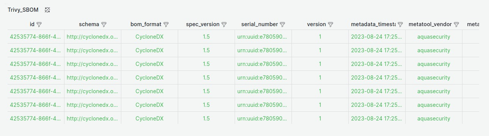

<p align="center">
  
</p>


<p align="center">
  The open-source platform for Visualize Kubernetes & DevSecOps Workflows
</p>

<div align="center">

[](https://github.com/kube-tarian/kubviz/actions/workflows/agent-kubviz-image.yml)
[](https://github.com/kube-tarian/kubviz/actions/workflows/client-image.yml)
[](https://github.com/kube-tarian/kubviz/actions/workflows/codeql.yml)
[](https://goreportcard.com/report/github.com/kube-tarian/kubviz)

[](https://github.com/kube-tarian/kubviz/blob/main/LICENSE)
[](https://github.com/kube-tarian/kubviz/discussions)
[](./code-of-conduct.md)
[](https://opensource.org/licenses/Apache-2.0)

</div>

<hr>


## KubViz

Visualize Kubernetes & DevSecOps Workflows. Tracks changes/events real-time across your entire K8s clusters, git repos, container registries, Container image Vulnerability scanning, misconfiguration, SBOM etc. , analyzing their effects and providing you with the context you need to troubleshoot efficiently. Get the Observability you need, easily.

## Table of Contents
- [How KubViz works](#how-kubviz-works)
- [Architecture diagram](#architecture-diagram)
- [How to install and run Kubviz](#how-to-install-and-run-kubviz)
- [Use Cases](#use-cases)
- [Contributing](#contributing)
- [Code of Conduct](#code-of-conduct)
- [Community](#community)
- [License](#license)

## How KubViz works

KubViz client can be installed on any Kubernetes cluster. KubViz agent runs in a kubernetes cluster where the changes/events need to be tracked. The agent detects the changes in real time and send those events via NATS JetStream and the same is received in the KubViz client.

KubViz client receives the events and passes it to Clickhouse database. The events present in the Clickhouse database can be visualized through Grafana.

KubViz's event tracking component provides comprehensive visibility into the changes and events occurring within your Kubernetes clusters.

KubViz offers a seamless integration with Git repositories, empowering you to effortlessly track and monitor changes that occur within your codebase. By capturing events such as commits, merges, and other Git activities.

KubViz also monitors changes in your container registry, providing visibility into image updates. By tracking these changes, KubViz helps you proactively manage container security and compliance.

It comprehensively scans Kubernetes containers for security flaws, such as vulnerabilities and misconfigurations, and creates an SBOM (Software Bill of Materials).

## Architecture diagram



## How to install and run Kubviz

#### Prerequisites
* A Kubernetes cluster
* Helm binary

#### Prepare Namespace

This command will create a new **namespace** for your cluster.

```bash
kubectl create namespace kubviz
```

#### Client Installation

```bash
helm repo add kubviz https://intelops.github.io/kubviz/
helm repo update
```

The following command will generate a token. Please make sure to take note of this token as it will be used for both client and agent installation purposes.

```bash
token=$(openssl rand -base64 32 | tr -dc 'a-zA-Z0-9' | fold -w 32 | head -n 1)
```

```bash
helm upgrade -i kubviz-client kubviz/client -n kubviz --set "nats.auth.token=$token"
```

**NOTE:**
- If you want to get a token from a secret, use a secret reference with the secret's name and key.

**NOTE:**
- If you want to enable Grafana with the client deployment, add `--set grafana.enabled=true` to the helm upgrade command.

- Kubviz provides a setup for Grafana with Postgres data persistence, ensuring that even if the grafana pod/service goes down, the data will persist, safeguarding crucial information for visualization and analysis.

```bash
helm upgrade -i kubviz-client kubviz/client -n kubviz --set "nats.auth.token=$token" --set grafana.enabled=true --set grafana.postgresql=true
```

- If grafana already exist use the same upgrade command without --set grafana.enabled=true flag.

```bash
helm upgrade -i kubviz-client kubviz/client -n kubviz --set "nats.auth.token=$token" --set grafana.enabled=true
```

Parameter | Description | Default
--------- | ----------- | -------
`grafana.enabled` | If true, create grafana | `false`
`grafana.postgresql` | If true, create postgresql | `false`

- The KubViz client will also install NATS and Clickhouse. The NATS service is exposed as a LoadBalancer, and you need to note the external IP of the service **kubviz-client-nats-external** and pass it during the KubViz agent installation.

The following command will retrieve the IP address. Please make sure to take note of this IP address as it will be used for agent installation if your agent is located in a different cluster.

```bash
kubectl get services kubviz-client-nats-external -n kubviz --output jsonpath='{.status.loadBalancer.ingress[0].ip}'
```
**NOTE:**
- Kubviz-client pod is in a CrashLoopBackOff state, installing the Kubviz-agent will bring it back up and running.

#### Agent Installation

##### Deploying Agent on the Same Kubernetes Cluster as kubeviz Client:
1. Make sure you have the KubViz client running on your Kubernetes cluster.
2. Run the following command to deploy the KubViz agent:

```bash
helm upgrade -i kubviz-agent kubviz/agent -n kubviz \
  --set "nats.auth.token=$token" \
  --set git_bridge.enabled=true \
  --set "git_bridge.ingress.hosts[0].host=<INGRESS HOSTNAME>",git_bridge.ingress.hosts[0].paths[0].path=/,git_bridge.ingress.hosts[0].paths[0].pathType=Prefix,git_bridge.ingress.tls[0].secretName=<SECRET-NAME>,git_bridge.ingress.tls[0].hosts[0]=<INGRESS HOSTNAME> \
  --set container_bridge.enabled=true \
  --set "container_bridge.ingress.hosts[0].host=<INGRESS HOSTNAME>",container_bridge.ingress.hosts[0].paths[0].path=/,container_bridge.ingress.hosts[0].paths[0].pathType=Prefix,container_bridge.ingress.tls[0].secretName=<SECRET-NAME>,container_bridge.ingress.tls[0].hosts[0]=<INGRESS HOSTNAME>
```

**NOTE:**
If you want to get a token from a secret, use a secret reference with the secret's name and key.

3. Replace "INGRESS HOSTNAME" with the desired hostname for the Git Bridge and Container Bridge Ingress configurations.
4. Replace "SECRET-NAME" with the desired secretname for the Git Bridge and Container Bridge Ingress configurations.

Parameter | Description | Default
--------- | ----------- | -------
`nats.host` | nats host | `kubviz-client-nats`
`git_bridge.enabled` | If true, create git_bridge | `false`
`git_bridge.ingress.hosts[0].host` | git_bridge ingress host name | `gitbridge.local`
`git_bridge.ingress.hosts[0].paths[0].path` | git_bridge ingress host path | `/`
`git_bridge.ingress.hosts[0].paths[0].pathType` | git_bridge ingress host path type | `Prefix`
`container_bridge.enabled` | If true, create container_bridge | `false`
`container_bridge.ingress.hosts[0].host` | container_bridge ingress host name | `containerbridge.local`
`container_bridge.ingress.hosts[0].paths[0].path` | container_bridge ingress host path | `/`
`container_bridge.ingress.hosts[0].paths[0].pathType` | container_bridge ingress host path type | `Prefix`
`git_bridge.ingress.tls` | git_bridge ingress tls configuration | []
`container_bridge.ingress.tls` | container_bridge ingress tls configuration | []

**NOTE:**

- Default Annotations for Ingress

By default, this Helm chart includes the following annotations for the git bridge and container bridge ingress resource:

```yaml
annotations:
  cert-manager.io/cluster-issuer: letsencrypt-prod-cluster
  kubernetes.io/force-ssl-redirect: "true"
  kubernetes.io/ssl-redirect: "true"
  kubernetes.io/tls-acme: "true"
...
```

If you do not want to use the default value, you can modify the annotation in [values.yaml](https://github.com/intelops/kubviz/blob/main/charts/agent/values.yaml#L60) and execute the following command:

```bash
helm upgrade -i kubviz-agent kubviz/agent -f values.yaml -n kubviz
```

##### Deploying Agent on a Different Kubernetes Cluster:
1. Run the following command to deploy the KubViz agent:

```bash
helm upgrade -i kubviz-agent kubviz/agent -n kubviz --set nats.host=<NATS IP Address> --set "nats.auth.token=$token"
```
2. Replace "<NATS IP Address>" with the IP address of your NATS service **kubviz-client-nats-external**.

**NOTE:**

The time-based job scheduler is added for each plugin, allowing you to schedule and automate the execution of plugins at specific times or intervals. To activate this scheduler, set 'enabled' to 'true.' Once enabled, each plugin's execution can be configured to run at a precise time or at regular intervals, based on the provided settings. Additionally, if you set the 'schedulingInterval' to '0', it will disable the plugins.

#### How to Verify if Everything is Up and Running

After completing the installation of both the client and agent, you can use the following command to verify if they are up and running.

```bash
kubectl get all -n kubviz
```

#### Configuration

Once everything is up and running, you need to perform additional configurations to monitor git repository events and container registry events.

To ensure that these events are sent to KubViz, you need to create a webhook for your repository. This webhook will transmit the event data of the specific repository or registry to KubViz.

To set up a webhook in your repository, [please follow these steps](docs/CONFIGURATION.md)

#### How to View Event Data in Grafana

1. Retrieve your Grafana login password by running the following command:

```bash
kubectl get secret --namespace kubviz kubviz-client-grafana -o jsonpath="{.data.admin-password}" | base64 --decode ; echo
```

2. Get the Grafana URL to visit by running these commands in the same shell:

```bash
export POD_NAME=$(kubectl get pods --namespace kubviz -l "app.kubernetes.io/name=grafana,app.kubernetes.io/instance=kubviz-client" -o jsonpath="{.items[0].metadata.name}")
```
```bash
kubectl --namespace kubviz port-forward $POD_NAME 3000
```

3. Access "localhost:3000" in your web browser, where you'll be prompted to enter your credentials. Utilize the username "admin" and the password obtained from step 1 to proceed.

#### mTLS - mutual TLS Feature

Mutual TLS (mTLS) is an extension of standard Transport Layer Security (TLS) that enhances security by requiring both the client and server to authenticate and verify each other's identities during the SSL/TLS handshake process. This mutual authentication helps ensure that both parties are who they claim to be, providing a higher level of security for sensitive data exchanges.

In our kubviz setup, we use mTLS for secure communication with the NATS server. Both the agent and the client connect to the NATS server using mTLS. The agent sends data to the NATS server securely, and the client also uses mTLS to receive data from the NATS server.

#### Why Use mTLS?

- **Enhanced Security:** mTLS ensures that both the client and server are authenticated, mitigating the risk of man-in-the-middle attacks.

- **Data Integrity:** By verifying identities, mTLS ensures that data is exchanged between trusted entities only.

- **Regulatory Compliance:** For many industries, mTLS is a requirement for compliance with regulations that mandate secure communication.

#### Configuring mTLS

To enable mTLS in your application for agent-to-NATS communication, [follow these steps:](docs/CONFIGURATION_MTLS.md)

#### TTL - Time-To-Live Feature

We've implemented a Time-To-Live (TTL) feature to streamline the management of data within your ClickHouse tables. With TTL, historical data can be automatically relocated to alternative storage or purged to optimize storage space. This feature is particularly valuable for scenarios like time-series data or logs where older data gradually loses its relevance over time.

#### Configuring TTL

The TTL value is customizable, empowering you to define the specific duration after which data is marked as 'expired'.

To guide you through the process of setting up a TTL, [please follow these steps](docs/CONFIGURATION_TTL.md)

#### Customizing Security Scanning

KubViz enables you to perform cluster scans, image scans, and SBOM creation in CycloneDX format. Utilizing this scan, vulnerabilities can be identified.

You can customize the security scans by changing the chart values.

- To [Disable](https://github.com/intelops/kubviz/blob/main/charts/agent/values.yaml#L186) the cluster scan you can pass 0 or empty string

```yaml
schedule:
  enabled: true
  trivyclusterscanInterval: 0
...
```
- For changing the interval, pass the interval time

```yaml
schedule:
  enabled: true
  trivyclusterscanInterval: "@every 24h"
...
```

Same you can change for [image-scan](https://github.com/intelops/kubviz/blob/main/charts/agent/values.yaml#L184) and [sbom](https://github.com/intelops/kubviz/blob/main/charts/agent/values.yaml#L185)

## Health Check

You can run different types of checks against your Kubernetes cluster to detect any issues or potential problems before they cause any downtime or service disruptions. Check will run in the background and sends data to kubviz. After analysing the data from dashboard you can take corrective action quickly, if any issues are detected.

Please check the [configuration](docs/CONFIGURATION_HEALTHCHECK.md) for health checks

## Use Cases

### Cluster Event Tracking



<br>

Use KubViz to monitor your cluster events, including:

- State changes
- Errors
- Other messages that occur in the cluster

<br>

<br clear="all">



<br>

- Visualize Deprecated Kubernetes APIs: KubViz provides a clear visualization of deprecated Kubernetes APIs, allowing users to easily identify and update their usage to comply with the latest Kubernetes versions
- Track Outdated Images: With KubViz, you can track and monitor outdated images within your clusters, ensuring that you are using the most up-to-date and secure versions.
- Identify Deleted APIs: KubeViz helps you identify any deleted APIs in your clusters, guiding you to find alternative approaches or replacements to adapt to changes in Kubernetes APIs.

<br>

<br clear="all">

### Git Repository Events Tracking



<br>

- KubViz allows you to track and observe all the events in your git repository..

- By capturing events such as commits, merges, and other Git activities, KubViz provides valuable insights into the evolution of your code. This comprehensive change tracking capability allows you to analyze the effects of code modifications on your development and deployment workflows, facilitating efficient collaboration among teams.With this feature, you can easily identify the root causes of issues, ensure code integrity, and maintain a clear understanding of the changes happening within your Git repositories

<br>

<br clear="all">

### Container Registry Events Tracking



<br>

- Using KubViz you can also monitors changes in your container registry, providing visibility into image updates. By tracking these changes, KubViz helps you proactively manage container registries.

<br>

<br clear="all">

### Kubernetes Container Security Tracking



<br>

- Using KubViz you can comprehensively scan the kubernetes containers for the security flaws such as vulnerabilities and misconfigurations.
- Detects comprehensive vulnerabilities in OS packages (Alpine, Red Hat Universal Base Image, Red Hat Enterprise Linux, CentOS, Oracle Linux, Debian, Ubuntu, Amazon Linux, openSUSE Leap, SUSE Enterprise Linux, Photon OS and Distroless).
- Detects configuration issues in Kubernetes cluster
<br>



<br clear="all">

### SBOM



<br>

- Generate reports for Software Bill of Materials (SBOM) from images within your Kubernetes cluster using KubViz in the CycloneDX format. These reports will be available in JSON format.

<br>

<br clear="all">

## Contributing

You are warmly welcome to contribute to KubViz.
Please refer the detailed guide [CONTRIBUTING.md](docs/CONTRIBUTING.md).

## Code of Conduct

See [CODE_OF_CONDUCT.md](docs/CODE_OF_CONDUCT.md)

## Community

Active communication channels
- Discord

## License

Refer the licence - [LICENCE](docs/LICENSE.md).
